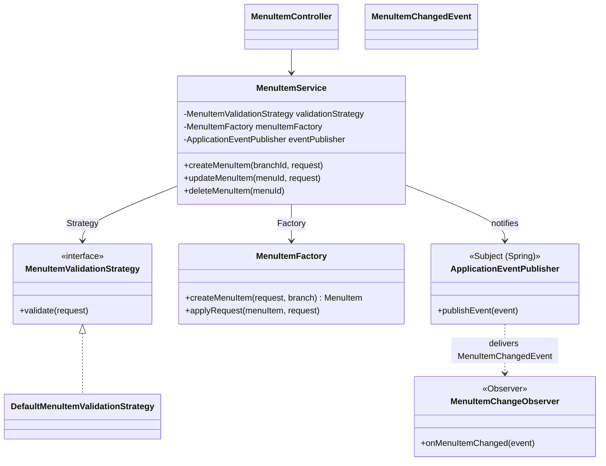

# Menu Management – Design Patterns

The menu module (`backend/src/main/java/com/example/BigBite/menu`) lets the Super Admin and branch managers create, edit, hide and delete the menu items of a branch, and lets everyone read them. It uses three design patterns:

| Pattern | Category | Where | Problem it solves |
|---|---|---|---|
| **Observer** (covered in lecture 8) | Behavioural | `event/MenuItemChangedEvent`, `observer/MenuItemChangeObserver`, `service/MenuItemService` | Tell other parts of the system that a menu item changed, without the service knowing who is listening |
| **Strategy** | Behavioural | `strategy/MenuItemValidationStrategy`, `strategy/DefaultMenuItemValidationStrategy` | Keep the validation rules swappable instead of hard-coding them in the service |
| **Factory** (Simple Factory) | Creational | `factory/MenuItemFactory` | Build a `MenuItem` from a request in one place, the same way for create and update |

## Module structure

```
menu/
├── controller/MenuItemController.java     REST endpoints (/api/menu)
├── service/MenuItemService.java           business logic – uses all three patterns
├── strategy/
│   ├── MenuItemValidationStrategy.java    Strategy interface
│   └── DefaultMenuItemValidationStrategy  concrete strategy
├── factory/MenuItemFactory.java           Factory
├── event/MenuItemChangedEvent.java        Observer: the message sent to observers
├── observer/MenuItemChangeObserver.java   Observer: concrete observer
├── security/MenuAccessGuard.java          who may change which branch's menu
├── entity/MenuItem.java                   JPA entity (table menu_items)
├── repository/MenuItemRepository.java     database access
└── dto/                                   request/response objects
```



---

## 1. Observer pattern (lecture 8)

**Lecture definition:** "Defines a one-to-many dependency between objects so that when one object changes state, all of its dependents are notified and updated automatically."

**Problem in the menu module:** when a manager creates, edits, hides or deletes an item, other parts of the system may need to react (log it, refresh a cache, tell the order module an item is no longer available). If `MenuItemService` called each of them directly it would depend on all of them, and every new listener would mean editing the service.

**Solution:** the service only announces *"a menu item changed"*. Anyone interested registers as an observer and is notified automatically. The service never knows who is listening.

### How it maps to the lecture's components

| Lecture component | Lecture example | Menu module |
|---|---|---|
| **Subject** – keeps the list of observers, `addObserver` / `removeObserver`, `notifyObservers()` | `Subject` interface | Spring's `ApplicationEventPublisher`. Every bean with an event-listener method is registered as an observer automatically when the application starts. |
| **ConcreteSubject** – holds the state and triggers notification on change | `TsunamiWarningSystem.setMessage()` | `MenuItemService`: after each create/update/delete it calls `eventPublisher.publishEvent(...)` (the equivalent of `notifyObservers()`). |
| **The state / message** passed to `update()` | `String message` | `MenuItemChangedEvent` – action, item id, name, branch, availability |
| **Observer** – interface with `update()` | `Observer.update(String)` | A method annotated `@TransactionalEventListener` that takes a `MenuItemChangedEvent` |
| **ConcreteObserver** – reacts to the update | `MobileApp`, `NewsChannel` | `MenuItemChangeObserver.onMenuItemChanged()` |

The lecture writes the subject's observer list by hand. Spring provides the same mechanism, so the module uses it rather than re-implementing it. The structure and the behaviour are the same: one publisher, any number of independent observers, notified automatically.

### The code

**The message** – `event/MenuItemChangedEvent.java`. An immutable object describing what changed:

```java
public class MenuItemChangedEvent {
    private final String action;      // "created" | "updated" | "deleted"
    private final Long menuId;
    private final String menuName;
    private final Long branchId;
    private final boolean available;
    ...
}
```

**The concrete subject notifying observers** – `service/MenuItemService.java` (lines 54–56, 95–96, 106–107):

```java
MenuItem saved = menuItemRepository.save(menuItemFactory.createMenuItem(request, branch));
eventPublisher.publishEvent(new MenuItemChangedEvent(
        "created", saved.getMenuId(), saved.getMenuName(), branchId, saved.isAvailability()));
```

The same call is made with `"updated"` after an edit and `"deleted"` after a delete. This is the `notifyObservers()` step: the service hands the event to the publisher and carries on. It does not know or care how many observers exist.

**The concrete observer** – `observer/MenuItemChangeObserver.java`:

```java
@Component
public class MenuItemChangeObserver {

    @TransactionalEventListener(fallbackExecution = true)
    public void onMenuItemChanged(MenuItemChangedEvent event) {     // = update(message)
        log.info("Menu item {}: id={}, name={}, branch={}, available={}", event.getAction(),
                event.getMenuId(), event.getMenuName(), event.getBranchId(), event.isAvailable());
    }
}
```

- `@Component` registers the observer with Spring (the lecture's `addObserver`). Deleting the class is the `removeObserver`.
- `@TransactionalEventListener` makes the notification arrive **after the database transaction commits**. Observers never react to a change that is later rolled back, such as a save that fails validation. `fallbackExecution = true` still delivers the event when there is no transaction.

### Adding another observer (no change to the service)

```java
@Component
public class MenuAvailabilityNotifier {
    @TransactionalEventListener
    public void onMenuItemChanged(MenuItemChangedEvent event) {
        if (!event.isAvailable()) {
            // e.g. tell the order module or the branch dashboard that the item is sold out
        }
    }
}
```

`MenuItemService` stays untouched. This is the loose coupling the lecture lists as the pattern's main advantage.

### Pros and cons in this module

| | |
|---|---|
| ✅ Loose coupling | The service does not depend on any listener |
| ✅ Open for extension | New reactions are new classes, not edits |
| ✅ Safe | After-commit delivery means observers only see changes that were really saved |
| ⚠️ Order of notification | With several observers the delivery order is not guaranteed (the lecture's stated drawback). It can be fixed with `@Order` if it ever matters. |
| ⚠️ Indirection | Reading the service alone doesn't show who reacts. The `observer/` package keeps them easy to find. |

---

## 2. Strategy pattern

**Intent:** define a family of algorithms, put each one in its own class, and make them interchangeable, so the code that uses them doesn't change when the algorithm does.

**Problem:** the rules for a valid menu item are business rules that can change, for example a price cap or a stricter rule for drinks. Hard-coding them inside `MenuItemService` would mix them with the create/update logic.

**Strategy interface** – `strategy/MenuItemValidationStrategy.java`:

```java
public interface MenuItemValidationStrategy {
    void validate(MenuItemRequestDto request);
}
```

**Concrete strategy** – `strategy/DefaultMenuItemValidationStrategy.java`:

```java
@Component
public class DefaultMenuItemValidationStrategy implements MenuItemValidationStrategy {
    @Override
    public void validate(MenuItemRequestDto request) {
        if (request == null) throw new IllegalArgumentException("Menu item data is required");
        if (request.getMenuName() == null || request.getMenuName().isBlank())
            throw new IllegalArgumentException("Menu name is required");
        if (request.getPrice() == null) throw new IllegalArgumentException("Price is required");
        if (request.getPrice().compareTo(BigDecimal.ZERO) <= 0)
            throw new IllegalArgumentException("Price must be greater than 0");
        if (request.getPrice().stripTrailingZeros().scale() > 2)
            throw new IllegalArgumentException("Price can have at most 2 decimal places");
    }
}
```

**Context** – `MenuItemService` depends only on the interface (constructor injection) and calls it before creating or updating (lines 48 and 90):

```java
private final MenuItemValidationStrategy validationStrategy;   // interface, not the concrete class
...
validationStrategy.validate(request);
```

Spring injects `DefaultMenuItemValidationStrategy` because it is the only implementation. To change the rules, add another class implementing the interface and mark it `@Primary`, or pick it with `@Qualifier`. The service code does not change.

Any rule violation throws `IllegalArgumentException`, which the global error handler turns into `400 {"error":"VALIDATION_ERROR","message":"Price must be greater than 0"}`.

---

## 3. Factory pattern (Simple Factory)

**Intent:** put object creation in one dedicated class, so callers ask for an object instead of building it field by field.

**Problem:** turning a `MenuItemRequestDto` into a `MenuItem` involves trimming the name and category, fixing the price to two decimals, and linking the branch. Create and update both need this, and copying it into two places invites mistakes.

`factory/MenuItemFactory.java`:

```java
@Component
public class MenuItemFactory {

    public MenuItem createMenuItem(MenuItemRequestDto request, Branch branch) {
        if (request == null) throw new IllegalArgumentException("Menu item data is required");
        MenuItem menuItem = new MenuItem();
        applyRequest(menuItem, request);
        menuItem.setBranch(branch);
        return menuItem;
    }

    public void applyRequest(MenuItem menuItem, MenuItemRequestDto request) {
        menuItem.setMenuName(request.getMenuName().trim());
        menuItem.setCategory(request.getCategory() != null ? request.getCategory().trim() : null);
        menuItem.setDescription(request.getDescription());
        menuItem.setPrice(request.getPrice().setScale(2, RoundingMode.UNNECESSARY));
        menuItem.setPhoto(request.getPhoto());
        menuItem.setAvailability(request.isAvailability());
    }
}
```

- **Create** (`MenuItemService` line 54): `menuItemFactory.createMenuItem(request, branch)` returns a ready entity.
- **Update** (line 92): `menuItemFactory.applyRequest(menuItem, request)` applies the same mapping rules to an existing entity.

This is a *Simple Factory*: one class with a creation method. It is not the GoF *Factory Method* pattern, which uses subclasses to decide which class to instantiate. There is only one kind of menu item, so the simple form is enough.

---

## How the patterns work together: creating a menu item

`POST /api/menu/branch/1` with `{"menuName":"Kottu Pizza","category":"Pizza","price":2100.00}` from the Colombo manager:

| Step | Code | Pattern |
|---|---|---|
| 1 | `MenuItemController.createMenuItem` checks the role (`SUPER_ADMIN` or `BRANCH_MANAGER`) and bean validation (`@Valid`) | – |
| 2 | `accessGuard.requireManageAccess(1)` – a manager may only change their own approved branch | – |
| 3 | `validationStrategy.validate(request)` – business rules | **Strategy** |
| 4 | Branch is loaded and must be `ACTIVE` | – |
| 5 | `menuItemFactory.createMenuItem(request, branch)` – builds the entity | **Factory** |
| 6 | `menuItemRepository.save(...)` – stored in `menu_items` | – |
| 7 | `eventPublisher.publishEvent(new MenuItemChangedEvent("created", …))` | **Observer** (subject notifies) |
| 8 | After the commit, `MenuItemChangeObserver.onMenuItemChanged` runs | **Observer** (observer updates) |
| 9 | `201 Created` with `MenuItemResponseDto` | – |

Log line produced by step 8:

```
Menu item created: id=31, name=Kottu Pizza, branch=1, available=true
```

## Tests that prove each pattern

| Pattern | Test | What it checks |
|---|---|---|
| Observer | `MenuItemServiceTest.createPublishesCreatedEvent`, `updatePublishesUpdatedEvent`, `deletePublishesDeletedEvent` | Each operation publishes a `MenuItemChangedEvent` with the right action, id and name (captured with Mockito) |
| Strategy | `DefaultMenuItemValidationStrategyTest` (7 tests) | Valid request accepted; null request, blank name, missing, zero or negative price, and more than 2 decimals rejected |
| Strategy (through the service) | `MenuItemServiceTest.createRejectsNonPositivePrice` | The service really delegates to the strategy |
| Factory + access rules | `MenuItemServiceTest` create/update tests | Entities are built and linked to the right branch; managers are limited to their own branch |

Run them with:

```bash
cd backend && ./mvnw test -Dtest='MenuItem*Test,DefaultMenuItemValidationStrategyTest'
```

## Quick viva answers

- **Which lecture pattern is used?** Observer. `MenuItemService` is the subject, `MenuItemChangedEvent` is the message, `MenuItemChangeObserver` is a concrete observer, and Spring's `ApplicationEventPublisher` keeps the observer list and calls them.
- **Why not write `Subject`/`Observer` interfaces by hand?** Spring already provides a tested subject (the event publisher) with automatic registration and transaction-aware delivery. Writing our own would duplicate it, and would notify observers even when the save rolls back.
- **What happens if the save fails?** The transaction rolls back and, because of `@TransactionalEventListener`, observers are never notified.
- **How do you add a new reaction?** Write a new `@Component` with a listener method for `MenuItemChangedEvent`. `MenuItemService` doesn't change.
- **Is Singleton used?** Not as a hand-written class. Spring creates each `@Component` and `@Service` once per application (singleton scope), which gives the same "one shared instance" effect without the testing and coupling problems the lecture lists.
