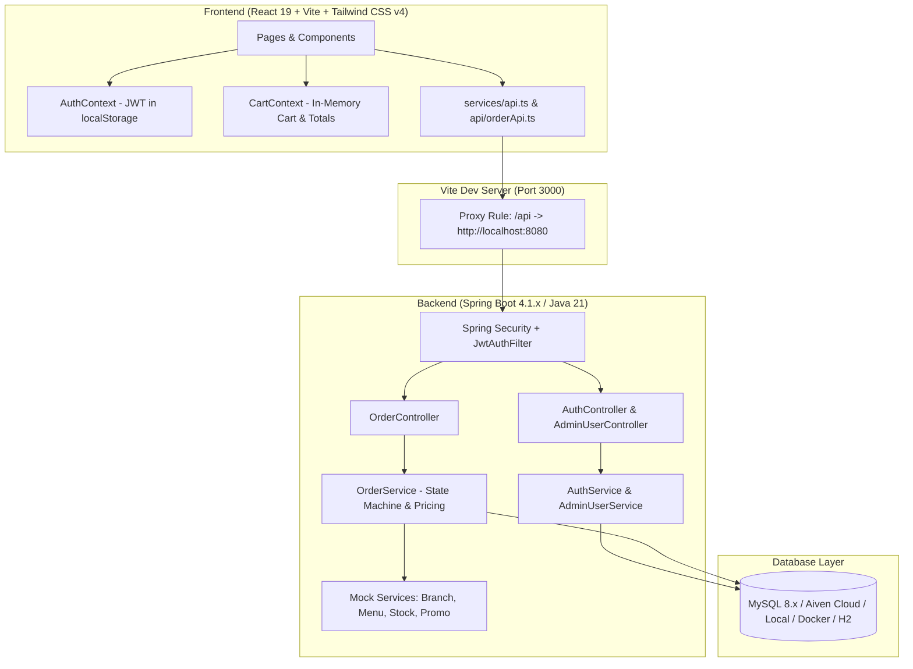
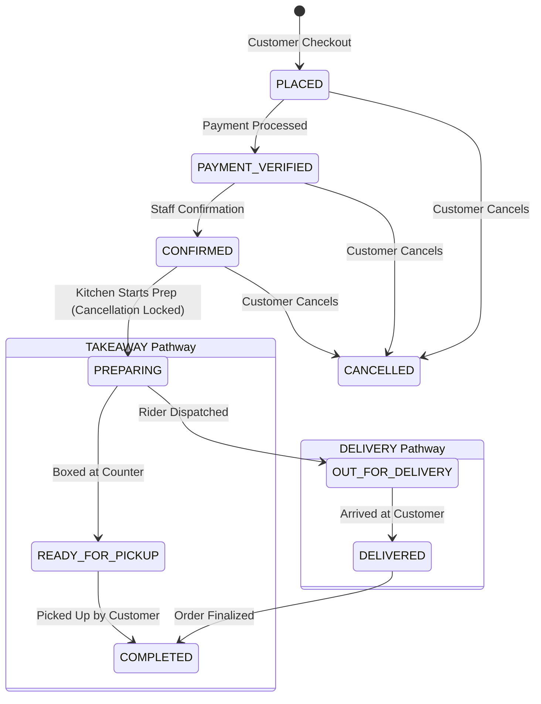

# BigBite — Comprehensive Agent & Developer Architecture Guide

This document serves as the single source of truth for AI agents and developers working on the **BigBite** codebase. It outlines the overall architecture, exact directory structure, technology stack, end-to-end features, UI design system, assets, API protocols, and agent operational rules.

---

## 1. Project Purpose & High-Level Architecture

**BigBite** is a full-stack, multi-branch food and pizza ordering platform with Role-Based Access Control (RBAC). It supports customers ordering food online, branch managers overseeing branch orders and menu fulfillment, delivery riders managing assigned deliveries, and a Super Administrator governing user registrations, staff approvals, and branch assignments.

### System Architecture Diagram



---

## 2. Full Project Directory Structure

```
BigBite/
├── backend/                                  # Spring Boot 4.1.x / Java 21 REST backend
│   ├── .env                                  # Active database & security environment variables
│   ├── .env.example                          # Sample environment configuration template
│   ├── mvnw / mvnw.cmd                       # Maven Wrapper executables
│   ├── pom.xml                               # Project dependencies (Spring Boot, JWT, MySQL, JPA, etc.)
│   └── src/
│       ├── main/
│       │   ├── java/com/example/BigBite/
│       │   │   ├── BigBiteApplication.java   # Spring Boot entry point
│       │   │   ├── auth/                     # Authentication & User Management Module
│       │   │   │   ├── Role.java             # SUPER_ADMIN, BRANCH_MANAGER, DELIVERY_PARTNER, CUSTOMER
│       │   │   │   ├── UserStatus.java       # ACTIVE, PENDING_APPROVAL, APPROVED, REJECTED, SUSPENDED
│       │   │   │   ├── User.java             # Unified JPA Entity for all system accounts
│       │   │   │   ├── UserRepository.java   # Spring Data JPA Repository with status/role filters
│       │   │   │   ├── AuthService.java      # Registration, status checks, password validation, JWT issue
│       │   │   │   ├── AdminUserService.java # SuperAdmin approval, rejection, and branch assignment
│       │   │   │   ├── AuthController.java   # Endpoints: /api/auth/{login, register/*, me}
│       │   │   │   ├── AdminUserController.java # Endpoints: /api/admin/users/**
│       │   │   │   ├── DataInitializer.java  # Auto-seeds default Super Admin on startup
│       │   │   │   ├── dto/                  # DTOs with JSR-380 validation annotations
│       │   │   │   ├── exception/            # AccountStatusException, GlobalExceptionHandler, etc.
│       │   │   │   └── security/             # JwtUtil, JwtAuthFilter, SecurityConfig, PasswordEncoder
│       │   │   └── order/                    # Order Processing & Billing Module
│       │   │       ├── Order.java            # Order entity (status, amounts, address, items)
│       │   │       ├── OrderItem.java        # Frozen snapshot line item entity
│       │   │       ├── OrderStatus.java      # State machine lifecycle enum
│       │   │       ├── FulfillmentType.java  # DELIVERY vs TAKEAWAY
│       │   │       ├── PaymentMethod.java    # CASH_ON_DELIVERY, CREDIT_CARD, etc.
│       │   │       ├── PaymentStatus.java    # PENDING, VERIFIED, FAILED
│       │   │       ├── SavedAddress.java     # User delivery addresses entity
│       │   │       ├── OrderRepository.java  # Order Data queries
│       │   │       ├── OrderService.java     # Order lifecycle, calculations, validation rules
│       │   │       ├── OrderController.java  # 8 REST endpoints for order creation, bill, payment, status
│       │   │       ├── dto/                  # Order, Bill, Payment, and Status DTOs
│       │   │       └── external/             # Mocked boundaries for external parallel microservices
│       │   └── resources/
│       │       └── application.properties    # Spring configuration, datasource bindings, JWT props
│       └── test/
│           ├── java/com/example/BigBite/     # Full unit & integration test suite
│           └── resources/
│               └── application.properties    # H2 in-memory test database configuration
├── frontend/                                 # React 19 + TypeScript + Vite + Tailwind CSS v4
│   ├── index.html                            # HTML entry point with viewport and meta
│   ├── package.json                          # NPM dependencies & scripts (dev, build, lint)
│   ├── tsconfig.json                         # TypeScript root compiler configuration
│   ├── vite.config.ts                        # Vite configuration with /api -> :8080 proxy
│   ├── public/
│   │   └── favicon.svg                       # BigBite browser tab icon
│   └── src/
│       ├── main.tsx                          # React DOM mounting root
│       ├── App.tsx                           # Global router, route protection, role gateways
│       ├── index.css                         # Tailwind CSS v4 `@theme` and global styles
│       ├── assets/
│       │   └── logo.svg                      # BigBite SVG brand vector logo
│       ├── api/
│       │   └── orderApi.ts                   # Typed API client for order endpoints
│       ├── components/
│       │   ├── Logo.tsx                      # Modular BigBite SVG logo component (full & mark)
│       │   ├── Navbar.tsx                    # Header with role-aware navigation, cart count, logout
│       │   ├── ProtectedRoute.tsx            # Route guard verifying JWT token and allowed roles
│       │   ├── RootRouteResolver.tsx         # Directs root path (`/`) dynamically by role
│       │   └── StatusStepper.tsx             # Horizontal visual state tracker for order progress
│       ├── context/
│       │   ├── AuthContext.tsx               # Auth provider (token, login, logout, getMe, role redirect)
│       │   └── CartContext.tsx               # In-memory cart provider, totals, item modifiers
│       ├── mocks/
│       │   └── orderMockData.ts              # Synchronized client mock dataset (branches, menu items)
│       ├── pages/
│       │   ├── WelcomePage.tsx               # Landing & marketing showcase page
│       │   ├── LoginPage.tsx                 # Sign-in form with error handling & role redirection
│       │   ├── RegisterPage.tsx              # Multi-tier registration (Customer, Branch Mgr, Rider)
│       │   ├── BranchSelectPage.tsx          # Step 1: Select branch for ordering
│       │   ├── MenuPage.tsx                  # Step 2: Browse categories and add items to cart
│       │   ├── CartPage.tsx                  # Step 3: Review cart, adjust quantities, select fulfillment
│       │   ├── CheckoutPage.tsx              # Step 4: Input delivery address and contact info
│       │   ├── PaymentPage.tsx               # Step 5: Choose payment method (Card / COD) & pay
│       │   ├── OrderStatusPage.tsx           # Step 6: Real-time order progress stepper & cancellation
│       │   ├── OrderHistoryPage.tsx          # Customer past orders archive
│       │   ├── CustomerHome.tsx              # Customer account profile and quick actions
│       │   ├── AdminDashboard.tsx            # SuperAdmin portal: approve/reject staff, assign branch
│       │   ├── BranchManagerDashboard.tsx    # Manager portal: branch orders & status updates
│       │   ├── DeliveryDashboard.tsx         # Rider portal: active deliveries & delivery status updates
│       │   └── StaffOrderListPage.tsx        # Unified staff order pipeline table
│       ├── services/
│       │   └── api.ts                        # Auth & Admin API client with safe error parsing
│       └── types/
│           ├── auth.ts                       # TypeScript interfaces for users, roles, statuses, responses
│           └── order.ts                      # TypeScript interfaces for orders, bills, payments, items
├── CONFIGURATION_AND_SETUP.md                # Guide for MySQL setup, ports, credentials, and run steps
├── ORDER_MODULE_README.md                    # Detailed order & billing specification & mock services
├── PROJECT_OVERVIEW.md                       # This document (Architecture, stack, features, UI, assets)
└── README.md                                 # Vite/React baseline readme
```

---

## 3. Technology Stack & Tooling

### Backend Stack
| Layer / Component | Technology | Description |
|---|---|---|
| **Runtime & Language** | Java 21 LTS | Amazon Corretto / Oracle OpenJDK 21 |
| **Framework** | Spring Boot 4.1.x | Modern Spring framework with reactive/stateless capabilities |
| **Persistence / ORM** | Spring Data JPA / Hibernate 7.4.x | Auto schema updates (`ddl-auto=update`), typed repositories |
| **Database Drivers** | MySQL Connector/J 9.7.0, HikariCP | High-performance pooled MySQL connections |
| **Security & JWT** | Spring Security 6.x, `jjwt` 0.12.6 | Stateless JWT HMAC-SHA256 bearer token authentication |
| **Password Hashing** | `BCryptPasswordEncoder` | Salted BCrypt password encoding |
| **Validation** | Jakarta Bean Validation / Hibernate Validator 9.x | DTO annotations (`@NotBlank`, `@Email`, `@Size`, `@Min`) |
| **Build & Dependency** | Maven 3.9+ via Maven Wrapper (`./mvnw`) | Standardized builds across developer and agent machines |
| **Testing** | JUnit 5, Mockito, H2 in-memory DB | Test-scoped unit and integration suites |

### Frontend Stack
| Layer / Component | Technology | Description |
|---|---|---|
| **Library & Runtime** | React 19, TypeScript 5.x | Functional components, custom hooks, strict type-checking |
| **Build Tool & Bundler** | Vite 8.x | Ultra-fast HMR, ES module bundling, `/api` proxying to port 8080 |
| **Styling & CSS** | Tailwind CSS v4 (`@tailwindcss/vite`) | Modern CSS-first configuration using `@theme` directive |
| **Routing** | React Router v7 (`react-router-dom`) | Client-side routing, protected routes, nested paths |
| **Icons** | Lucide React | High-quality, tree-shaken SVG icon collection |
| **State Management** | React Context API | `AuthContext` (persisted JWT), `CartContext` (in-memory cart) |
| **HTTP Client** | Native `fetch` with `handleApiResponse` | Safe JSON parsing, automatic 502/network fallback handling |

---

## 4. Key Features & Business Logic

### A. Authentication & Role-Based Access Control (RBAC)

1. **User Roles**:
   - `CUSTOMER`: Can place orders, track orders, save delivery addresses, and view order history.
   - `BRANCH_MANAGER`: Manages orders for an assigned `branchId`, moves orders to `PREPARING` and `READY_FOR_PICKUP`.
   - `DELIVERY_PARTNER`: Delivers orders for a branch, moves orders to `OUT_FOR_DELIVERY`, `DELIVERED`, and `COMPLETED`.
   - `SUPER_ADMIN`: System-wide access. Reviews staff registrations, approves or rejects staff, assigns branches to approved staff, and deletes users.

2. **Account Status Lifecycle**:
   - `ACTIVE`: Fully operational. Customers are automatically `ACTIVE` upon registration.
   - `PENDING_APPROVAL`: Default status for self-registered `BRANCH_MANAGER` and `DELIVERY_PARTNER`. Cannot log in until approved.
   - `APPROVED`: Marked by SuperAdmin; awaiting branch assignment.
   - `REJECTED`: Rejected by SuperAdmin with an optional reason.
   - `SUSPENDED`: Administratively suspended.

3. **Status-Gated Login**:
   - `AuthService.login()` validates email and password.
   - If user status is `PENDING_APPROVAL`, it returns `403 Forbidden` with the message: *"Your account is awaiting admin approval. Please check back later."*
   - If user status is `REJECTED`, it returns `403 Forbidden` with the rejection reason.

4. **SuperAdmin Seed**:
   - `DataInitializer.java` auto-checks on startup if a `SUPER_ADMIN` exists. If not, it seeds:
     - **Email**: `admin@bigbite.com`
     - **Password**: `Admin@123`

---

### B. Order & Billing Lifecycle State Machine

Order statuses follow an exact non-reversible sequential pipeline:



#### Order Cancellation Rules:
- **Allowed States**: `PLACED`, `PAYMENT_VERIFIED`, `CONFIRMED`.
- **Locked States**: `PREPARING`, `READY_FOR_PICKUP`, `OUT_FOR_DELIVERY`, `DELIVERED`, `COMPLETED`.
- Attempting to cancel an order in `PREPARING` or later throws `IllegalStateException` (HTTP 400).

#### Pricing & Billing Calculations:
- **Subtotal**: Sum of `(item.price * item.quantity)` for all items.
- **Tax (GST/VAT)**: Automatically calculated at **10%** of subtotal.
- **Delivery Fee**: Fixed at **250.00 LKR** when `fulfillmentType = DELIVERY`, and **0.00 LKR** for `TAKEAWAY`.
- **Discount**: Applied if a valid promo code is provided.
- **Total Amount**: `Subtotal + Tax + DeliveryFee - Discount`.

#### External Mock Services:
Located in `backend/.../order/external/`:
- `MockBranchLookupService`: Validates branch open status and takeaway support.
- `MockMenuLookupService`: Validates item prices and branch availability.
- `MockInventoryCheckService`: Validates stock availability.
- `MockPromotionValidationService`: Validates discount voucher codes.

---

## 5. UI Design System & Styling Architecture

The user interface follows a modern, clean, high-conversion food-service design inspired by top-tier food delivery platforms.

### A. Color Palette

| Token / Color Name | Hex Code | Usage |
|---|---|---|
| **Brand Red (Primary)** | `#E4002B` | Buttons, badges, active steppers, links, primary highlights |
| **Brand Red Dark** | `#C40024` | Hover states, button press states |
| **Brand Red Light** | `#FF2B4F` | Gradients, badges, soft glow accents |
| **Brand Red Hover** | `#D00027` | Hover states on interactive cards |
| **Page Background** | `#F8F9FA` | Neutral light background for eye comfort |
| **Card Background** | `#FFFFFF` | White surface with soft borders |
| **Neutral Text Primary** | `#18181B` / `#111827` | Main headings, prices, important content |
| **Neutral Text Secondary**| `#71717A` / `#6B7280` | Subtitles, labels, order timestamps |
| **Border Accent** | `rgba(229, 231, 235, 0.8)` | Subtle `border-neutral-200/80` dividing cards |

### B. Typography & Component Styles
- **Font Family**: Inter, `-apple-system`, `BlinkMacSystemFont`, `Segoe UI`, Roboto, sans-serif.
- **Cards**: `rounded-3xl` with `shadow-xl` and `border border-neutral-200/80`.
- **Inputs & Buttons**: `rounded-xl`, `py-3 px-4`, bold text, focus rings in `ring-red-100` with `border-[#E4002B]`.
- **Micro-Interactions**: Active buttons scale slightly (`active:scale-98`), hover transitions (`transition-all duration-200`).
- **Feedback & Loaders**: Rounded SVG spinner with `#E4002B` border color.
- **Selection Color**: `selection:bg-[#E4002B] selection:text-white`.

---

## 6. Assets & Visual Resources

All static assets are located in the repository folders:

### 1. `frontend/src/assets/logo.svg`
The primary vector logo for the BigBite application. It features a red shield background with a stylized white pizza slice with cheese crust and pepperoni slices.

### 2. `frontend/src/components/Logo.tsx`
A React SVG component that supports two rendering variants:
- `<Logo variant="full" />`: Displays the red shield logo alongside bold "Big**Bite**" typography. Supports `lightText` prop for dark headers.
- `<Logo variant="mark" />`: Displays only the compact pizza shield icon (ideal for mobile navbars and app icons).

### 3. `frontend/public/favicon.svg`
High-resolution SVG favicon configured in `frontend/index.html` for browser tabs and mobile bookmarks.

### 4. `frontend/src/mocks/orderMockData.ts`
Synchronized client-side mock repository providing mock branches and menu items:
- **Branches**:
  - `ID: 1` — Colombo Branch (Open: Yes, Takeaway: Yes)
  - `ID: 2` — Jaffna Branch (Open: No, Takeaway: No)
  - `ID: 3` — Kandy Branch (Open: Yes, Takeaway: Yes)
- **Menu Items**:
  - `101`: Margherita Pizza (1,200 LKR)
  - `102`: Pepperoni Pizza (1,400 LKR)
  - `103`: BBQ Chicken Pizza (1,600 LKR)
  - `104`: Garlic Bread (500 LKR)
  - `105`: Coca Cola 500ml (300 LKR)

---

## 7. Frontend Routing & Access Matrix

All routes are declared in [frontend/src/App.tsx](file:///Users/jathushansundararasu/Desktop/BigBite/frontend/src/App.tsx) and guarded by [frontend/src/components/ProtectedRoute.tsx](file:///Users/jathushansundararasu/Desktop/BigBite/frontend/src/components/ProtectedRoute.tsx):

| Path | Component | Allowed Roles | Description |
|---|---|---|---|
| `/` | `RootRouteResolver` | Public / All | Redirects to role landing page or `WelcomePage` |
| `/login` | `LoginPage` | Public | Email + password login form |
| `/register` | `RegisterPage` | Public | Multi-role registration (Customer/Staff) |
| `/order` | `BranchSelectPage` | `CUSTOMER` | Select open branch |
| `/branch/:branchId/menu` | `MenuPage` | `CUSTOMER` | Browse menu & add to cart |
| `/cart` | `CartPage` | `CUSTOMER` | Adjust cart, select Delivery/Takeaway |
| `/checkout` | `CheckoutPage` | `CUSTOMER` | Enter delivery address & phone |
| `/order/:orderId/payment` | `PaymentPage` | `CUSTOMER` | Choose Card / Cash on Delivery |
| `/order/:orderId` | `OrderStatusPage` | `CUSTOMER` | Live stepper status tracker & cancel button |
| `/orders` | `OrderHistoryPage` | `CUSTOMER` | Archive list of user's past orders |
| `/customer/profile` | `CustomerHome` | `CUSTOMER` | Customer profile & quick order links |
| `/admin` | `AdminDashboard` | `SUPER_ADMIN` | Approve staff, assign branches, manage users |
| `/branch-manager/dashboard`| `BranchManagerDashboard`| `BRANCH_MANAGER` | Branch order pipeline & status transition |
| `/delivery/dashboard` | `DeliveryDashboard` | `DELIVERY_PARTNER` | Active delivery orders & delivery complete |
| `/staff/orders` | `StaffOrderListPage` | `BRANCH_MANAGER`, `DELIVERY_PARTNER` | Table view of branch orders |

---

## 8. Backend REST API Reference

### Authentication & User Management (`/api/auth`, `/api/admin`)
| Method | Endpoint | Auth Required | Description |
|---|---|---|---|
| `POST` | `/api/auth/register/customer` | None | Register active customer |
| `POST` | `/api/auth/register/branch-manager` | None | Register branch manager (`PENDING_APPROVAL`) |
| `POST` | `/api/auth/register/delivery-partner` | None | Register delivery partner (`PENDING_APPROVAL`) |
| `POST` | `/api/auth/login` | None | Authenticate user & return JWT |
| `GET` | `/api/auth/me` | Bearer JWT | Return authenticated user details |
| `GET` | `/api/admin/users/pending` | `SUPER_ADMIN` | List staff awaiting approval |
| `PUT` | `/api/admin/users/{id}/approve` | `SUPER_ADMIN` | Approve staff account |
| `PUT` | `/api/admin/users/{id}/reject` | `SUPER_ADMIN` | Reject staff account with optional reason |
| `PUT` | `/api/admin/users/{id}/assign-branch` | `SUPER_ADMIN` | Assign staff to `branchId` |
| `GET` | `/api/admin/users` | `SUPER_ADMIN` | Filter users by `role` and/or `status` |
| `DELETE`| `/api/admin/users/{id}` | `SUPER_ADMIN` | Delete user account |

### Orders & Billing (`/api/orders`)
| Method | Endpoint | Auth Required | Description |
|---|---|---|---|
| `POST` | `/api/orders` | Customer | Create order in `PLACED` state |
| `GET` | `/api/orders/{id}` | Any Authenticated | Fetch order details & items |
| `GET` | `/api/orders/{id}/bill` | Any Authenticated | Get itemized bill calculation |
| `POST` | `/api/orders/{id}/payment` | Customer | Record payment & update status |
| `PUT` | `/api/orders/{id}/status` | Staff / Admin | Advance order in state machine |
| `POST` | `/api/orders/{id}/cancel` | Customer / Admin | Cancel order (if before `PREPARING`) |
| `GET` | `/api/orders/user/{userId}` | Any Authenticated | List all orders for a customer |
| `GET` | `/api/orders/branch/{branchId}` | Staff / Admin | List all orders for a branch |

---

## 9. Important Instructions for AI Agents & Developers

When inspecting or extending this codebase, adhere to these rules:

1. **Do Not Unconditionally Parse JSON**:
   In `frontend/src/services/api.ts`, always use `handleApiResponse<T>()` or safe text extraction. Never call `await res.json()` directly before checking response status, or 502/empty error pages will trigger `SyntaxError: Unexpected end of JSON input`.

2. **Environment Variables**:
   Database settings in `backend/.env` override `backend/src/main/resources/application.properties`.
   When running offline, ensure local MySQL is running or configure `application.properties` with an H2 profile.

3. **Running the Applications**:
   - Backend:
     ```bash
     cd backend
     ./mvnw spring-boot:run
     ```
     Starts on `http://localhost:8080`.
   - Frontend:
     ```bash
     cd frontend
     npm install
     npm run dev
     ```
     Starts on `http://localhost:3000` with Vite reverse-proxy forwarding `/api` to port 8080.

4. **Testing Quality Gates**:
   - Run backend tests:
     ```bash
     cd backend
     ./mvnw test
     ```
   - Build frontend:
     ```bash
     cd frontend
     npm run build
     ```
